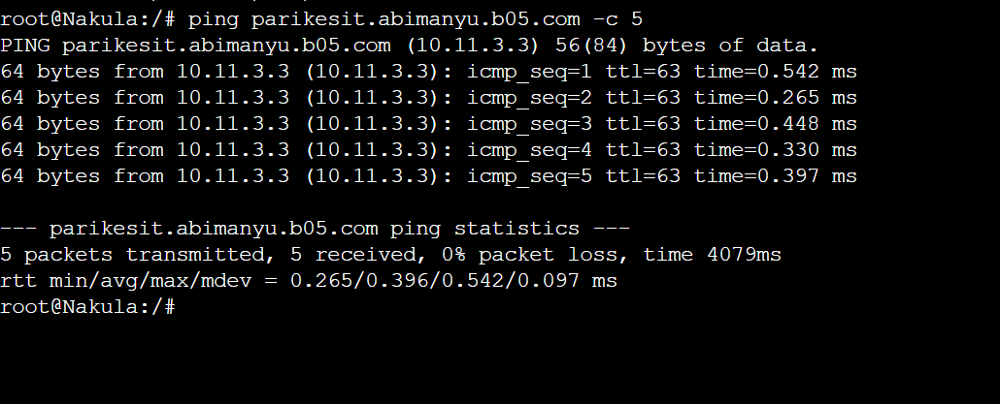

# Jarkom-Modul-2-B05-2023

### Praktikum Jarkom Modul 1
Group Members:
| NRP | Name |
| ------ | ------ |
|5025211028|Keysa Anadea Aqiva Ajie|
|5025221202|Hilmy Septian Nursyekha|
   
# Question 1

Yudhistira akan digunakan sebagai DNS Master, Werkudara sebagai DNS Slave, Arjuna merupakan Load Balancer yang terdiri dari beberapa Web Server yaitu Prabakusuma, Abimanyu, dan Wisanggeni. Buatlah topologi dengan pembagian sebagai berikut. Folder topologi dapat diakses pada drive berikut (Topologi 1)


Testing pada client Nakula dan Yudhistira

```
ping google.com -c 2
```


# Question 2

Buatlah website utama pada node arjuna dengan akses ke arjuna.yyy.com dengan alias www.arjuna.yyy.com dengan yyy merupakan kode kelompok.

Melakukan setup berikut pada node DNS Master
```
echo 'zone "arjuna.b05.com" {
        type master;
        allow-transfer { 10.11.3.5; }; // IP Arjuna
        file "/etc/bind/jarkom/arjuna.b05.com";
};' > /etc/bind/named.conf.local

mkdir /etc/bind/jarkom

cp /etc/bind/db.local /etc/bind/jarkom/arjuna.b05.com

echo '
;
; BIND data file for local loopback interface
;
$TTL    604800
@       IN      SOA     arjuna.b05.com. root.arjuna.b05.com. (
                        2023101001      ; Serial
                         604800         ; Refresh
                          86400         ; Retry
                        2419200         ; Expire
                         604800 )       ; Negative Cache TTL
;
@       IN      NS      arjuna.b05.com.
@       IN      A       10.11.1.2     ; IP Yudhistira
www     IN      CNAME   arjuna.b05.com.' > /etc/bind/jarkom/arjuna.b05.com

```
kemudian lakukan
```
service bind9 restart
```
cek dengan prompt berikut 
```
host -t CNAME www.arjuna.b05.com
ping arjuna.b05.com -c 5
ping www.arjuna.b05.com -c 5
```


# Question 3

Dengan cara yang sama seperti soal nomor 2, buatlah website utama dengan akses ke abimanyu.yyy.com dan alias www.abimanyu.yyy.com.

Melakukan setup berikut pada node DNS Master
```
echo 'zone "arjuna.b05.com" {
        type master;
        file "/etc/bind/jarkom/arjuna.b05.com";
        allow-transfer { 10.11.3.5; }; // IP Arjuna
};

zone "abimanyu.b05.com" {
        type master;
        file "/etc/bind/jarkom/abimanyu.b05.com";
        allow-transfer { 10.11.3.5; }; // IP Arjuna
};' > /etc/bind/named.conf.local

cp /etc/bind/db.local /etc/bind/jarkom/abimanyu.b05.com

echo '
;
; BIND data file for local loopback interface
;
$TTL    604800
@       IN      SOA     abimanyu.b05.com. root.abimanyu.b05.com. (
                        2023101001      ; Serial
                         604800         ; Refresh
                          86400         ; Retry
                        2419200         ; Expire
                         604800 )       ; Negative Cache TTL
;
@       IN      NS      abimanyu.b05.com.
@       IN      A       10.11.1.2     ; IP Yudhistira
www     IN      CNAME   abimanyu.b05.com.' > /etc/bind/jarkom/abimanyu.b05.com

```
kemudian lakukan
```
service bind9 restart
```
kemudian cek dengan
```
ping abimanyu.b05.com -c 5
ping www.abimanyu.b05.com -c 5
```


# Question 4

Kemudian, karena terdapat beberapa web yang harus di-deploy, buatlah subdomain parikesit.abimanyu.yyy.com yang diatur DNS-nya di Yudhistira dan mengarah ke Abimanyu.

Menyiapkan konfigurasi awal. Untuk subdomain, diperlukan penambahan pengaturan ```parikesit``` dengan tipe ```A``` yang mengarahkan ke alamat IP Abimanyu.  Dan juga menambahkan 
``` 
parikesit IN    A       10.11.3.3     ; IP Abimanyu' >
/etc/bind/jarkom/abimanyu.b05.com
```
```
echo '
;
; BIND data file for local loopback interface
;
$TTL    604800
@       IN      SOA     abimanyu.b05.com. root.abimanyu.b05.com. (
                        2023101001      ; Serial
                         604800         ; Refresh
                          86400         ; Retry
                        2419200         ; Expire
                         604800 )       ; Negative Cache TTL
;
@       IN      NS      abimanyu.b05.com.
@       IN      A       10.11.1.2     ; IP Yudhistira
www     IN      CNAME   abimanyu.b05.com.
parikesit IN    A       10.11.3.3     ; IP Abimanyu' > /etc/bind/jarkom/abimanyu.b05.com

```
jangan lupa prompt berikut setelah save
```
service bind9 restart
```
cek dengan
```
ping parikesit.abimanyu.b05.com -c 5
```



# Question 5

Buat juga reverse domain untuk domain utama. (Abimanyu saja yang direverse)

Agar dapat mengatur reverse domain, penting untuk mengetahui alamat IP Abimanyu. Dalam kasus ini, IP Abimanyu dari kelompok B05 adalah 10.11.3.3, dan langkah selanjutnya adalah mengonversinya menjadi 3.3.11.10.

```
echo 'zone "arjuna.b05.com" {
        type master;
allow-transfer { 10.11.3.5; }; // IP Arjuna
        file "/etc/bind/jarkom/arjuna.b05.com";
 
};

zone "abimanyu.b05.com" {
        type master;
 allow-transfer { 10.11.3.5; }; // IP Arjuna
        file "/etc/bind/jarkom/abimanyu.b05.com";
};

zone "1.11.10.in-addr.arpa" {
        type master;
        file "/etc/bind/jarkom/1.11.10.in-addr.arpa";
};' > /etc/bind/named.conf.local

cp /etc/bind/db.local /etc/bind/jarkom/1.11.10.in-addr.arpa

echo ';
; BIND data file for local loopback interface
;
$TTL    604800
@       IN      SOA     abimanyu.b05.com. root.abimanyu.b05.com. (
                        2003101001      ; Serial
                         604800         ; Refresh
                          86400         ; Retry
                        2419200         ; Expire
                         604800 )       ; Negative Cache TTL
;
1.11.10.in-addr.arpa. IN      NS      abimanyu.b05.com.
2                     IN      PTR     abimanyu.b05.com.' > /etc/bind/jarkom/1.11.10.in-addr.arpa

```
jangan lupa
```
service bind9 restart
```
jangan lupa juga kembalikan `nameserver`
```
host -t PTR 10.11.1.2
```


# Question 6

Agar dapat tetap dihubungi ketika DNS Server Yudhistira bermasalah, buat juga Werkudara sebagai DNS Slave untuk domain utama.


Untuk menjalankan tugas DNS Slave, diperlukan beberapa pengaturan pada DNS Master dan juga pada DNS Slave (Werkudara)

Di DNS Master, penting untuk mengatur `also-notify` dan `allow-transfer`` sehingga memberikan otorisasi kepada alamat IP yang dituju.

```
echo 'zone "arjuna.b05.com" {
        type master;
        notify yes;
        also-notify { 10.11.2.2; }; // IP Werkudara
        allow-transfer { 10.11.2.2; }; // IP Werkudara
        file "/etc/bind/jarkom/arjuna.b05.com";
};

zone "abimanyu.b05.com" {
        type master;
        notify yes;
        also-notify { 10.11.2.2; }; // IP Werkudara
        allow-transfer { 10.11.2.2; }; // IP Werkudara
        file "/etc/bind/jarkom/abimanyu.b05.com";
};

zone "1.11.10.in-addr.arpa" {
        type master;
        file "/etc/bind/jarkom/1.11.10.in-addr.arpa";
};' > /etc/bind/named.conf.local

```
jangan lupa
```
service bind9 restart
```
kemudian cek dengan
```
ping abimanyu.b05.com -c 5
ping www.abimanyu.b05.com -c 5
```


# Question 7

Seperti yang kita tahu karena banyak sekali informasi yang harus diterima, buatlah subdomain khusus untuk perang yaitu baratayuda.abimanyu.yyy.com dengan alias www.baratayuda.abimanyu.yyy.com yang didelegasikan dari Yudhistira ke Werkudara dengan IP menuju ke Abimanyu dalam folder Baratayuda.


Sebelum mulai tugas ini, konfigurasi awal harus dilakukan. Delegasi subdomain memerlukan pengaturan pada DNS Master dan DNS Slave. Selain itu, perlu menggunakan `allow-query { any; };` pada `DNS Master` dan `Slave`. Selain itu, `NS` (Name Server) juga diperlukan karena `NS` digunakan dalam delegasi zona `DNS` untuk menggunakan authoritative name server yang telah ditentukan.

Di DNS Master, kita harus memasukkan entri `ns1      IN       A     192.173.2.2     ; IP Werkudara` ini untuk mendapatkan otoritas atas Werkudara. Selain itu, perlu mengaktifkan `allow-query { any; };` di `DNS Master`.

## Yudhistira
```
echo ';
; BIND data file for local loopback interface
;
$TTL    604800
@       IN      SOA     abimanyu.b05.com. root.abimanyu.b05.com. (
                        2023101001      ; Serial
                         604800         ; Refresh
                          86400         ; Retry
                        2419200         ; Expire
                         604800 )       ; Negative Cache TTL
;
@            IN     NS      abimanyu.b05.com.
@            IN     A       10.11.1.2     ; IP Yudhistira
www          IN     CNAME   abimanyu.b05.com.
parikesit    IN     A       10.11.3.3     ; IP Abimanyu
ns1          IN     A       10.11.2.2     ; IP Werkudara
baratayuda   IN     NS      ns1' > /etc/bind/jarkom/abimanyu.b05.com

echo "options {
    directory \"/var/cache/bind\";

    // If there is a firewall between you and nameservers you want
    // to talk to, you may need to fix the firewall to allow multiple
    // ports to talk.  See http://www.kb.cert.org/vuls/id/800113

    // If your ISP provided one or more IP addresses for stable
    // nameservers, you probably want to use them as forwarders.
    // Uncomment the following block, and insert the addresses replacing
    // the all-0's placeholder.

    // forwarders {
    //      0.0.0.0;
    // };

    //========================================================================
    // If BIND logs error messages about the root key being expired,
    // you will need to update your keys.  See https://www.isc.org/bind-keys
    //========================================================================
    //dnssec-validation auto;

    allow-query { any; };
    auth-nxdomain no;
    listen-on-v6 { any; };
};" > /etc/bind/named.conf.options

```
jangan lupa
```
service bind9 restart
```
Pada `DNS Slave`, kita harus mengarahkan zona ke `DNS Master` agar otoritasnya dapat berjalan. Selain itu, perlu mengaktifkan `allow-query { any; };` di `DNS Slave`.

## Werkudara

```
echo 'zone "baratayuda.abimanyu.b05.com" {
        type master;
        file "/etc/bind/baratayuda/baratayuda.abimanyu.b05.com";
};' >> /etc/bind/named.conf.local

mkdir /etc/bind/baratayuda

cp /etc/bind/db.local /etc/bind/baratayuda/baratayuda.abimanyu.b05.com

echo '
;
; BIND data file for local loopback interface
;
$TTL    604800
@       IN      SOA     baratayuda.abimanyu.b05.com. root.baratayuda.abimanyu.b05.com. (
                        2023101001      ; Serial
                         604800         ; Refresh
                          86400         ; Retry
                        2419200         ; Expire
                         604800 )       ; Negative Cache TTL
;
@       IN      NS      baratayuda.abimanyu.b05.com.
@       IN      A       10.11.3.3     ; IP Abimanyu
www     IN      CNAME   baratayuda.abimanyu.b05.com.' > /etc/bind/baratayuda/baratayuda.abimanyu.b05.com

echo "options {
    directory \"/var/cache/bind\";

    // If there is a firewall between you and nameservers you want
    // to talk to, you may need to fix the firewall to allow multiple
    // ports to talk.  See http://www.kb.cert.org/vuls/id/800113

    // If your ISP provided one or more IP addresses for stable
    // nameservers, you probably want to use them as forwarders.
    // Uncomment the following block, and insert the addresses replacing
    // the all-0's placeholder.

    // forwarders {
    //      0.0.0.0;
    // };

    //========================================================================
    // If BIND logs error messages about the root key being expired,
    // you will need to update your keys.  See https://www.isc.org/bind-keys
    //========================================================================
    //dnssec-validation auto;

    allow-query { any; };
    auth-nxdomain no;
    listen-on-v6 { any; };
};" > /etc/bind/named.conf.options
```
jangan lupa
```
service bind9 restart
```
Test
```
ping baratayuda.abimanyu.b05.com -c 5
ping www.baratayuda.abimanyu.b05.com -c 5
```


# Question 8

Untuk informasi yang lebih spesifik mengenai Ranjapan Baratayuda, buatlah subdomain melalui Werkudara dengan akses rjp.baratayuda.abimanyu.yyy.com dengan alias www.rjp.baratayuda.abimanyu.yyy.com yang mengarah ke Abimanyu.

Karena sebelumnya telah dilakukan delegasi ke `DNS Slave` dan sekarang diberikan perintah untuk membuat subdomain dalam delegasi domain tersebut, langkah selanjutnya adalah melakukan penambahan pada `DNS` Slave seperti berikut.
```
rjp             IN      A       10.11.3.3     ; IP Abimanyu
www.rjp         IN      CNAME   rjp.baratayuda.abimanyu.b05.com.
```

## Werkudara

```
echo ';
; BIND data file for local loopback interface
;
$TTL    604800
@       IN      SOA     baratayuda.abimanyu.b05.com. root.baratayuda.abimanyu.b05.com. (
                        2023101001      ; Serial
                         604800         ; Refresh
                          86400         ; Retry
                        2419200         ; Expire
                         604800 )       ; Negative Cache TTL
;
@               IN      NS      baratayuda.abimanyu.b05.com.
@               IN      A       10.11.3.3     ; IP Abimanyu
www             IN      CNAME   baratayuda.abimanyu.b05.com.
rjp             IN      A       10.11.3.3     ; IP Abimanyu
www.rjp         IN      CNAME   rjp.baratayuda.abimanyu.b05.com.' > /etc/bind/baratayuda/baratayuda.abimanyu.b05.com
```
jangan lupa
```
service bind9 restart
```
Test
```
# ping rjp.baratayuda.abimanyu.b05.com -c 5
# ping www.rjp.baratayuda.abimanyu.b05.com -c 5
```


# Question 9

Arjuna merupakan suatu Load Balancer Nginx dengan tiga worker (yang juga menggunakan nginx sebagai webserver) yaitu Prabakusuma, Abimanyu, dan Wisanggeni. Lakukan deployment pada masing-masing worker.

Untuk menjalankan load balancing, beberapa pengaturan pada `Arjuna` diperlukan.

Pertama-tama, pastikan bahwa `Arjuna` sudah dikonfigurasi dengan benar, termasuk konfigurasi `Nginx` dan aturan load balancing. Kita harus memilih algoritma load balancing yang cocok dengan kebutuhan, seperti round-robin atau algoritma lainnya.

Kemudian, lakukan proses deployment pada setiap worker. Ini melibatkan mengunggah aplikasi atau layanan web yang ingin diload balance ke setiap worker. Pastikan bahwa semua worker sudah diatur dengan benar dan siap untuk melayani lalu lintas web.

Setelah semua tahap konfigurasi dan deployment selesai, `Arjuna` akan berperan sebagai load balancer yang akan mendistribusikan lalu lintas web ke worker yang tersedia.

## Arjuna
```
echo 'upstream backend {
  server 10.11.3.2; # IP Prabukusuma
  server 10.11.3.3; # IP Abimanyu
  server 10.11.3.4; # IP Wisanggeni
}

server {
  listen 80;
  server_name arjuna.b05.com www.arjuna.b05.com;

  location / {
    proxy_pass http://backend;
  }
}
' > /etc/nginx/sites-available/jarkom
```
lakukan `symlink` dengan command
```
ln -s /etc/nginx/sites-available/jarkom /etc/nginx/sites-enabled/jarkom
```
Untuk menghindari konflik port dengan pengaturan default yang ada saat menginstal `nginx`, diperlukan penghapusan file `default` tersebut.
```
rm /etc/nginx/sites-enabled/default
```
restart
```
service nginx restart
```
Test
```
ping rjp.baratayuda.abimanyu.b05.com -c 5
ping www.rjp.baratayuda.abimanyu.b05.com -c 5

```

## Abimanyu, Wisanggeni, dan Prabukusuma
run `shell` pada masing-masing
```
service php7.0-fpm start

echo 'server {
        listen 80;

        root /var/www/jarkom;
        index index.php index.html index.htm index.nginx-debian.html;

        server_name _;

        location / {
                try_files $uri $uri/ /index.php?$query_string;
        }

        location ~ \.php$ {
                include snippets/fastcgi-php.conf;
                fastcgi_pass unix:/run/php/php7.0-fpm.sock;
        }

        location ~ /\.ht {
                deny all;
        }
}' > /etc/nginx/sites-available/jarkom

ln -s /etc/nginx/sites-available/jarkom /etc/nginx/sites-enabled/jarkom

rm /etc/nginx/sites-enabled/default
```
jangan lupa
```
service nginx restart
```
## Client Nakula

Lakukan test berikut 
```
lynx http://10.11.3.2
lynx http://10.11.3.3
lynx http://10.11.3.4
lynx http://10.11.3.5
lynx http://arjuna.b05.com
```


# Question 10

Kemudian gunakan algoritma Round Robin untuk Load Balancer pada Arjuna. Gunakan server_name pada soal nomor 1. Untuk melakukan pengecekan akses alamat web tersebut kemudian pastikan worker yang digunakan untuk menangani permintaan akan berganti ganti secara acak. Untuk webserver di masing-masing worker wajib berjalan di port 8001-8003. Contoh
    - Prabukusuma:8001
    - Abimanyu:8002
    - Wisanggeni:8003

Setelah berhasil menyelesaikan langkah ke-9 dalam proses deployment, langkah selanjutnya adalah melakukan penyesuaian pada port masing-masing worker agar sesuai dengan port yang telah ditentukan, yaitu `Prabukusuma:8001, Abimanyu:8002, dan Wisanggeni:8003`. Selain itu, diperlukan perubahan pada konfigurasi port `load-balancing` dengan menambahkan `:800X` pada setiap server.

## Arjuna (Load Balancing)
```
upstream backend {
  server 10.11.3.2:8001; # IP Prabukusuma
  server 10.11.3.3:8002; # IP Abimanyu
  server 10.11.3.4:8003; # IP Wisanggeni
}
```

## Prabukusuma, Abimanyu, dan Wisanggeni

X merupakan port yang telah disesuaikan dengan setiap `worker` secara individual.

```
echo 'server {
        listen 800X;

        root /var/www/jarkom;
        index index.php index.html index.htm index.nginx-debian.html;

        server_name _;

        location / {
                try_files $uri $uri/ /index.php?$query_string;
        }

        location ~ \.php$ {
                include snippets/fastcgi-php.conf;
                fastcgi_pass unix:/run/php/php7.0-fpm.sock;
        }

        location ~ /\.ht {
                deny all;
        }
}' > /etc/nginx/sites-available/jarkom
```

# Question 11

Selain menggunakan Nginx, lakukan konfigurasi Apache Web Server pada worker Abimanyu dengan web server www.abimanyu.yyy.com. Pertama dibutuhkan web server dengan DocumentRoot pada /var/www/abimanyu.yyy

Untuk menyelesaikan tugas ini, diperlukan beberapa pengaturan. Salah satunya adalah yang berkaitan dengan konfigurasi `Yudhistira`, di mana kita akan mengalihkan alamat IP yang sebelumnya ditujukan ke `Werkudara` agar sekarang menuju `Abimanyu`. Selain itu, diperlukan penggunaan `ServerAlias` agar memungkinkan penggunaan www di masa yang akan datang.

## Yudhistira
```
# 11
echo ';
; BIND data file for local loopback interface
;
$TTL    604800
@       IN      SOA     abimanyu.b05.com. root.abimanyu.b05.com. (
                        2023101001      ; Serial
                         604800         ; Refresh
                          86400         ; Retry
                        2419200         ; Expire
                         604800 )       ; Negative Cache TTL
;
@       IN      NS      abimanyu.b05.com.
@       IN      A       10.11.3.3     ; IP Abimanyu
www     IN      CNAME   abimanyu.b05.com.
parikesit IN    A       10.11.3.3     ; IP Abimanyu
ns1     IN      A       10.11.2.2     ; IP Werkudara
baratayuda IN   NS      ns1' > /etc/bind/jarkom/abimanyu.b05.com
```
jangan lupa
```
service bind9 restart
```
## Abimanyu
```
cp /etc/apache2/sites-available/000-default.conf /etc/apache2/sites-available/abimanyu.b05.com.conf

rm /etc/apache2/sites-available/000-default.conf

echo -e '<VirtualHost *:80>
  ServerAdmin webmaster@localhost
  DocumentRoot /var/www/abimanyu.b05

  ServerName abimanyu.b05.com
  ServerAlias www.abimanyu.b05.com

  ErrorLog ${APACHE_LOG_DIR}/error.log
  CustomLog ${APACHE_LOG_DIR}/access.log combined
</VirtualHost>' > /etc/apache2/sites-available/abimanyu.b05.com.conf

a2ensite abimanyu.b05.com.conf
```
jangan lupa
```
service apache2 restart
```
## Cek pada Client
```
lynx abimanyu.b05.com
```


# Question 12

Setelah itu ubahlah agar url www.abimanyu.yyy.com/index.php/home menjadi www.abimanyu.yyy.com/home.

Di sini, kita memanfaatkan `Directory` yang akan melakukan pengubahan (rewrite) terhadap Indexes. Hal ini dilakukan untuk memungkinkan penggunaan `Alias`.
```
<Directory /var/www/abimanyu.b05/index.php/home>
  Options +Indexes
</Directory>

Alias "/home" "/var/www/abimanyu.b05/index.php/home"
```
## Abimanyu
```
echo -e '<VirtualHost *:80>
  ServerAdmin webmaster@localhost
  DocumentRoot /var/www/abimanyu.b05
  ServerName abimanyu.b05.com
  ServerAlias www.abimanyu.b05.com

  <Directory /var/www/abimanyu.b05/index.php/home>
          Options +Indexes
  </Directory>

  Alias "/home" "/var/www/abimanyu.b05/index.php/home"

  ErrorLog ${APACHE_LOG_DIR}/error.log
  CustomLog ${APACHE_LOG_DIR}/access.log combined
</VirtualHost>' > /etc/apache2/sites-available/abimanyu.b05.com.conf
```
jangan lupa
```
service apache2 restart
```
## Client
```
lynx abimanyu.a09.com/home
curl abimanyu.a09.com/home
```


# Question 13

Selain itu, pada subdomain www.parikesit.abimanyu.yyy.com, DocumentRoot disimpan pada /var/www/parikesit.abimanyu.yyy

Hanya diperlukan setup `ServerName` dan `ServerAlias`

## Abimanyu

```
echo -e '<VirtualHost *:80>
  ServerAdmin webmaster@localhost
  DocumentRoot /var/www/parikesit.abimanyu.b05
  ServerName parikesit.abimanyu.b05.com
  ServerAlias www.parikesit.abimanyu.b05.com

  ErrorLog ${APACHE_LOG_DIR}/error.log
  CustomLog ${APACHE_LOG_DIR}/access.log combined
</VirtualHost>' > /etc/apache2/sites-available/parikesit.abimanyu.b05.com.conf

a2ensite parikesit.abimanyu.b05.com.conf
```
jangan lupa
```
service apache2 restart
```
## Client
```
lynx parikesit.abimanyu.b05.com
curl parikesit.abimanyu.b05.com
```


# Question 14

Pada subdomain tersebut folder /public hanya dapat melakukan directory listing sedangkan pada folder /secret tidak dapat diakses (403 Forbidden).

Karena kita ingin mengizinkan publik agar dapat melihat directory  `listing`, kita menggunakan opsi `Options +Indexes`. Sementara untuk mencegah akses ke suatu folder, kita dapat menggunakan opsi `Option -Indexes`.

## Abimanyu 
```
echo -e '<VirtualHost *:80>
  ServerAdmin webmaster@localhost
  DocumentRoot /var/www/parikesit.abimanyu.b05
  ServerName parikesit.abimanyu.b05.com
  ServerAlias www.parikesit.abimanyu.b05.com

  <Directory /var/www/parikesit.abimanyu.b05/public>
          Options +Indexes
  </Directory>

  <Directory /var/www/parikesit.abimanyu.b05/secret>
          Options -Indexes
  </Directory>

  Alias "/public" "/var/www/parikesit.abimanyu.b05/public"
  Alias "/secret" "/var/www/parikesit.abimanyu.b05/secret"

  ErrorLog ${APACHE_LOG_DIR}/error.log
  CustomLog ${APACHE_LOG_DIR}/access.log combined
</VirtualHost>' > /etc/apache2/sites-available/parikesit.abimanyu.b05.com.conf

service apache2 restart
```
## Client
```
lynx parikesit.abimanyu.b05.com/public
lynx parikesit.abimanyu.b05.com/secret
```


# Question 15

Buatlah kustomisasi halaman error pada folder /error untuk mengganti error kode pada Apache. Error kode yang perlu diganti adalah 404 Not Found dan 403 Forbidden.

Untuk halaman HTML `error`, kita menggunakan file yang disediakan dalam `resources`, yang dapat ditemukan di direktori parikesit.abimanyu.b05.com/public/error/. Di dalam direktori tersebut, terdapat dua filr, yaitu `403.html` dan `404.html`. Selain itu, kita memanfaatkan `ErrorDocument` yang bertujuan untuk mengarahkan ke berkas yang sesuai ketika terjadi masalah saat mengakses domain yang telah ada sebelumnya.

```
echo -e '<VirtualHost *:80>
  ServerAdmin webmaster@localhost
  DocumentRoot /var/www/parikesit.abimanyu.b05
  ServerName parikesit.abimanyu.b05.com
  ServerAlias www.parikesit.abimanyu.b05.com

  <Directory /var/www/parikesit.abimanyu.b05/public>
          Options +Indexes
  </Directory>

  <Directory /var/www/parikesit.abimanyu.b05/secret>
          Options -Indexes
  </Directory>

  Alias "/public" "/var/www/parikesit.abimanyu.b05/public"
  Alias "/secret" "/var/www/parikesit.abimanyu.b05/secret"

  ErrorDocument 404 /error/404.html
  ErrorDocument 403 /error/403.html

  ErrorLog ${APACHE_LOG_DIR}/error.log
  CustomLog ${APACHE_LOG_DIR}/access.log combined
</VirtualHost>' > /etc/apache2/sites-available/parikesit.abimanyu.b05.com.conf

service apache2 restart
```
## Client
```
lynx parikesit.abimanyu.b05.com/testerror
lynx parikesit.abimanyu.b05.com/secret
```


# Question 16

Buatlah suatu konfigurasi virtual host agar file asset www.parikesit.abimanyu.yyy.com/public/js menjadi 
www.parikesit.abimanyu.yyy.com/js 

Di sini, langkah yang perlu diambil adalah mengggunakan 
`Alias "/js" "/var/www/parikesit.abimanyu.b09/public/js"` guna membuat alamat virtual host lebih singkat. Selain itu, kami menggunakan `ServerName` dan `ServerAlias` untuk memastikan agar virtual host berjalan dengan baik.

## Abimanyu

```
echo -e '<VirtualHost *:80>
  ServerAdmin webmaster@localhost
  DocumentRoot /var/www/parikesit.abimanyu.b05
  ServerName parikesit.abimanyu.b05.com
  ServerAlias www.parikesit.abimanyu.b05.com

  <Directory /var/www/parikesit.abimanyu.b05/public>
          Options +Indexes
  </Directory>

  <Directory /var/www/parikesit.abimanyu.b05/secret>
          Options -Indexes
  </Directory>

  Alias "/public" "/var/www/parikesit.abimanyu.b05/public"
  Alias "/secret" "/var/www/parikesit.abimanyu.b05/secret"
  Alias "/js" "/var/www/parikesit.abimanyu.b05/public/js"

  ErrorDocument 404 /error/404.html
  ErrorDocument 403 /error/403.html

  ErrorLog ${APACHE_LOG_DIR}/error.log
  CustomLog ${APACHE_LOG_DIR}/access.log combined
</VirtualHost>' > /etc/apache2/sites-available/parikesit.abimanyu.b05.com.conf
```
## Client
```
lynx parikesit.abimanyu.b05.com/js
```


# Question 17

Agar aman, buatlah konfigurasi agar www.rjp.baratayuda.abimanyu.yyy.com hanya dapat diakses melalui port 14000 dan 14400.

Untuk menyesuaikan port tertentu, langkah yang diperlukan adalah mengedit file `ports.conf` dengan menambahkan perintah `Listen 14000` dan `Listen 14400`. Selanjutnya, kita juga perlu mengubah bagian `<VirtualHost *:14000 *:14400>`.

## Abimanyu

```
echo -e '<VirtualHost *:14000 *:14400>
  ServerAdmin webmaster@localhost
  DocumentRoot /var/www/rjp.baratayuda.abimanyu.b05
  ServerName rjp.baratayuda.abimanyu.b05.com
  ServerAlias www.rjp.baratayuda.abimanyu.b05.com

  ErrorDocument 404 /error/404.html
  ErrorDocument 403 /error/403.html

  ErrorLog ${APACHE_LOG_DIR}/error.log
  CustomLog ${APACHE_LOG_DIR}/access.log combined
</VirtualHost>' > /etc/apache2/sites-available/rjp.baratayuda.abimanyu.b05.com.conf

echo -e '# If you just change the port or add more ports here, you will likely also
# have to change the VirtualHost statement in
# /etc/apache2/sites-enabled/000-default.conf

Listen 80
Listen 14000
Listen 14400

<IfModule ssl_module>
        Listen 443
</IfModule>

<IfModule mod_gnutls.c>
        Listen 443
</IfModule>

# vim: syntax=apache ts=4 sw=4 sts=4 sr noet' > /etc/apache2/ports.conf

a2ensite rjp.baratayuda.abimanyu.b05.com.conf
```
jangan lupa
```
service apache2 restart
```
## Client
```
lynx rjp.baratayuda.abimanyu.b05.com:14000
lynx rjp.baratayuda.abimanyu.b05.com:14400
```


# Question 18

Untuk mengaksesnya buatlah autentikasi username berupa “Wayang” dan password “baratayudayyy” dengan yyy merupakan kode kelompok. Letakkan DocumentRoot pada /var/www/rjp.baratayuda.abimanyu.yyy.

Untuk mengimplementasikan autentikasi pada server, dibutuhkan pengaturan seperti `AuthType` dan `Require Valid-User`. `AuthUserFile` digunakan untuk menentukan lokasi penyimpanan informasi autentikasi yang dapat ditulis. Sementara `AuthName` mengacu pada jenis autentikasi yang digunakan dalam konfigurasi `Apache2`.

## Abimanyu

```
echo -e '<VirtualHost *:14000 *:14400>
  ServerAdmin webmaster@localhost
  DocumentRoot /var/www/rjp.baratayuda.abimanyu.b05
  ServerName rjp.baratayuda.abimanyu.b05.com
  ServerAlias www.rjp.baratayuda.abimanyu.b05.com

  <Directory /var/www/rjp.baratayuda.abimanyu.b05>
          AuthType Basic
          AuthName "Restricted Content"
          AuthUserFile /etc/apache2/.htpasswd
          Require valid-user
  </Directory>

  ErrorDocument 404 /error/404.html
  ErrorDocument 403 /error/403.html

  ErrorLog ${APACHE_LOG_DIR}/error.log
  CustomLog ${APACHE_LOG_DIR}/access.log combined
</VirtualHost>' > /etc/apache2/sites-available/rjp.baratayuda.abimanyu.b05.com.conf

a2ensite rjp.baratayuda.abimanyu.b05.com.conf
```
jangan lupa
```
service apache2 restart
```
Sisipkan proses autentikasi dengan menggunakan perintah `htpasswd`. Penggunaan `-c` mengindikasikan `created` file dan -b merupakan `bcrypt` supaya password yang dimasukkan akan di-hash terlebih dahulu sebelum disimpan.

```
htpasswd -c -b /etc/apache2/.htpasswd Wayang baratayudab05
```

## Client
```
lynx rjp.baratayuda.abimanyu.b05.com:14000
lynx rjp.baratayuda.abimanyu.b05.com:14400
```


# Question 19

Buatlah agar setiap kali mengakses IP dari Abimanyu akan secara otomatis dialihkan ke www.abimanyu.yyy.com (alias)

Untuk mengalihkan otomatis saat mengakses IP dari Abimanyu ke www.abimanyu.b05.com, kami menggunakan file `Redirect` yang mengarahkan ke lokasi yang diinginkan. Langkah ini diimplementasikan dalam file konfigurasi `000-default.conf` karena berkas tersebut adalah konfigurasi default dari Apache.

## Abimanyu

```
echo -e '<VirtualHost *:80>
    ServerAdmin webmaster@abimanyu.b05.com
    DocumentRoot /var/www/html

    ErrorLog ${APACHE_LOG_DIR}/error.log
    CustomLog ${APACHE_LOG_DIR}/access.log combined

    Redirect / http://www.abimanyu.b05.com/
</VirtualHost>' > /etc/apache2/sites-available/000-default.conf
```
Testing
```
apache2ctl configtest
service apache2 restart
```
## Client

```
lynx 10.11.3.3
```


# Question 20

Karena website www.parikesit.abimanyu.yyy.com semakin banyak pengunjung dan banyak gambar gambar random, maka ubahlah request gambar yang memiliki substring “abimanyu” akan diarahkan menuju abimanyu.png.

## Abimanyu
 run `rewrite modul`
 
 ```
 a2enmod rewrite
 ```

untuk melakukan `rewrite` terhadap directory `parikesit.abimanyu.b05`

```
echo 'RewriteEngine On
RewriteCond %{REQUEST_URI} ^/public/images/(.*)(abimanyu)(.*\.(png|jpg))
RewriteCond %{REQUEST_URI} !/public/images/abimanyu.png
RewriteRule abimanyu http://parikesit.abimanyu.b05.com/public/images/abimanyu.png$1 [L,R=301]' > /var/www/parikesit.abimanyu.b05/.htaccess
```
ubah config dan pakai `AllowOverride All` untuk mengkonfigurasi `.httaccess`.

```
echo -e '<VirtualHost *:80>
  ServerAdmin webmaster@localhost
  DocumentRoot /var/www/parikesit.abimanyu.b05

  ServerName parikesit.abimanyu.b05.com
  ServerAlias www.parikesit.abimanyu.b05.com

  <Directory /var/www/parikesit.abimanyu.b05/public>
          Options +Indexes
  </Directory>

  <Directory /var/www/parikesit.abimanyu.b05/secret>
          Options -Indexes
  </Directory>

  <Directory /var/www/parikesit.abimanyu.b05>
          Options +FollowSymLinks -Multiviews
          AllowOverride All
  </Directory>

  Alias "/public" "/var/www/parikesit.abimanyu.b05/public"
  Alias "/secret" "/var/www/parikesit.abimanyu.b05/secret"
  Alias "/js" "/var/www/parikesit.abimanyu.b05/public/js"

  ErrorDocument 404 /error/404.html
  ErrorDocument 403 /error/403.html

  ErrorLog ${APACHE_LOG_DIR}/error.log
  CustomLog ${APACHE_LOG_DIR}/access.log combined
</VirtualHost>' > /etc/apache2/sites-available/parikesit.abimanyu.b05.com.conf
```
jangan lupa
```
service apache2 restart
```
## Client

```
lynx parikesit.abimanyu.b05.com/public/images/notis-abimanyu.png
lynx parikesit.abimanyu.b05.com/public/images/abimanyu-loveee.jpg
lynx parikesit.abimanyu.b05.com/public/images/abimanyu.png
```


